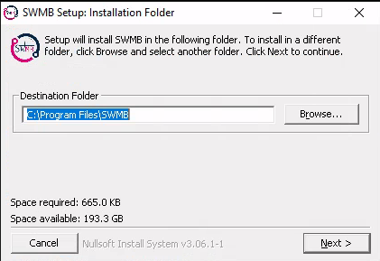
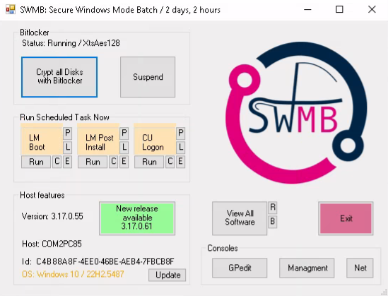

# SWMB - Secure Windows Mode Batch

 * [CONTRIBUTING](./CONTRIBUTING.md)
 * [FAQ](./FAQ.md)
 * [LICENSE](./LICENSE.md)
 * [NEWS](./NEWS.md)
 * [REFERENCES](./REFERENCES.md)
 * [USE CASE (distribution)](./dists/README.md)

## Preamble

This is a PowerShell script for automation of routine tasks done after fresh installations of Windows 10 and Windows Server 2016 / 2019.
This is by no means any complete set of all existing Windows tweaks and neither is it another "antispying" type of script.
It's simply a setting which I like to use and which in my opinion make the system less obtrusive.

SWMB is a project from the SWMB working group of the RESINFO business network of CNRS and the French higher education.
It is about managing security, confidentiality and privacy under the Windows 10 operating system with the help of scripts,
thus without using a graphical interface.
The objective is to be able to easily deploy security tweaks (strategy) on a computer park,
whether or not the computers are in an Active Directory domain.
In a concern of tracing (quality) and knowledge sharing, all possible actions are readable in a text format.
The chosen programming language is Microsoft Powershell.
All the code and documentation is available on a Git forge.

The choice to implement a scripting system is therefore a complementary choice to a solution with GPO associated with Active Directory servers.
The question of how SWMB is deployed on the workstations is not directly linked to the SWMB project itself.
It is software like any other and can therefore be integrated into any configuration management system.

The project is intended to be modular.
It must be easy to maintain, easy to understand, easy to extend and easy to use.
The website https://www.ghacks.net/2015/08/14/comparison-of-windows-10-privacy-tools/ references many possible solutions.
SWMB chose to take as a starting point the code of Disassembler0 which is now archived: `Win10-Initial-Setup-Script`,
because it met all our criteria above.

Regarding the applicable security strategies,
SWMB is mainly based on the tweaks enacted by the French National Agency for Information Systems Security ([ANSSI](https://www.ssi.gouv.fr/)).
There are thus three levels of possible tweaks in SWMB:
 * `Modules\SWMB\Win10` - tweaks extracted from the ANSSI documentation, or from certain instructions of the RSSI of the CNRS,
    applicable in the whole ESR (Higher Education and Research in France);
 * `Modules\SWMB\Custom` - interesting tweaks that you can extend for your site.
 * `Modules\SWMB\Experimental` - future tweaks under active development and not fully tested.
    Feedback from users may be interesting.

Each tweak can be enabled (`enable`) or disabled (`disable`) very easily in a configuration file (`preset`).
Sample files are available.
Each tweak is associated with a comment in French or English referring to its origin.
The French language has sometimes been chosen in order to follow the ANSSI's terminology
and because of the French version of Windows 10 which is used in most of our computers in the ESR.

For `Custom` tweaks, it is possible to set them with a variable file in order to adapt them to your park.
A set of default parameters is proposed.
The other tweaks are not configurable, because they are, at first, to take or to leave!
The upstream project on which we based ourselves had not planned to be able to parameterize tweaks.
It is an extension that we added.

**Some references**:
 * Upstream project `Win10-Initial-Setup-Script` by Disassembler0 user :
   https://github.com/Disassembler0/Win10-Initial-Setup-Script
 * Document from the [ANSSI](https://fr.wikipedia.org/wiki/Agence_nationale_de_la_s%C3%A9curit%C3%A9_des_syst%C3%A8mes_d%27information)
   (Agence Nationale de la Sécurité des Systèmes d'Information - France) :
   [https://www.ssi.gouv.fr/administration/guide/restreindre-la-collecte-de-donnees-sous-windows-10/](https://www.ssi.gouv.fr/administration/guide/restreindre-la-collecte-de-donnees-sous-windows-10/)
 * Document of the [BSI](https://fr.wikipedia.org/wiki/Office_f%C3%A9d%C3%A9ral_de_la_s%C3%A9curit%C3%A9_des_technologies_de_l%27information)
   (Federal Office for Information Technology Security - Germany) :
   [https://www.bsi.bund.de/SharedDocs/Downloads/EN/BSI/Cyber-Security/SiSyPHuS/AP11/Hardening_Guideline.pdf](https://www.bsi.bund.de/SharedDocs/Downloads/EN/BSI/Cyber-Security/SiSyPHuS/AP11/Hardening_Guideline.pdf)

More references on the page [REFERENCES](./REFERENCES.md).


## Installation

You can find on https://resinfo-gt.pages.in2p3.fr/swmb/resinfo-swmb/ the latest versions of the SWMB installer.
These setup packages are made with the [NSIS](https://sf.net/projects/nsis/) software (Nullsoft Scriptable Install System).
It is possible not to install and activate scheduled tasks at computer startup and user logon.




It is possible to do a silent installation with the `/S` flag.
The `/ACTIVATED_PRESET` flag can be set to 0 if you do not want the default presets
to be installed for predefined scheduled tasks (see [Tasks](#task)).

```
SWMB-Setup-XXX.XXX.XXX.exe /S /ACTIVATED_PRESET=0
```

You will also find, in the [dists](dists) directory, examples of deployment of the script
(manual, at machine startup, with OCS Inventory, WAPT package, volume encryption...).

The [README](dists/manual-use/README.md) file in the "manual-use" directory
reminds some principles about Powershell execution policies.


## Usage

If you just want to run the script with the default preset,
download and unpack the [latest release](https://github.com/Disassembler0/Win10-Initial-Setup-Script/releases)
and then simply double-click on the *Default.cmd* file and confirm *User Account Control* prompt.
Make sure your account is a member of *Administrators* group as the script attempts to run with elevated privileges.

The script supports command line options and parameters which can help you customize the tweak selection or even add your own custom tweaks,
however these features require some basic knowledge of command line usage and PowerShell scripting.
Refer to [Advanced usage](#advanced-usage) section for more details.

### Direct use from PowerShell

```ps1
# Execution of a single function / tweak
.\swmb.ps1 NameOfTheTweak

# Execution of a preset of tweaks
.\swmb.ps1 -preset "Presets\LocalMachine-Default.preset"
```

### Integrated use in a PowerShell script

```ps1
# Loading the SWMB base engine with all the main modules (neested)
# Put only SWMB.psm1 if you want only the core
Import-Module Modules\SWMB.psd1

# Initialize
SWMB_Init

# Load a preset file (can be called several times)
# Each preset file is a suite of tweaks
SWMB_LoadTweakFile "Presets\LocalMachine-Default.preset"

# Load one tweak (can be called multiple times)
# Unloads the tweak if it starts with the exclamation mark (!)
SWMB_AddOrRemoveTweak "NomFonction"

# If you want to check the consistency of tweaks
SWMB_CheckTweaks

# Execute all loaded tweaks (presets)
SWMB_RunTweaks
```

### Advanced usage

    powershell.exe -NoProfile -ExecutionPolicy Bypass -File swmb.ps1 [-import filename] [-preset filename] [-log logname] [[!]tweakname]

    -import filename        load module with user-defined tweaks
    -preset filename        load preset with tweak names to apply
    -log logname            save script output to a file
    tweakname               apply tweak with this particular name
    !tweakname              remove tweak with this particular name from selection

### All command line option

`swmb.ps1` currently supports the following parameters:

 * `-core` : if used, it must be the first option.
   Import only the core (minimal) module `SWMB.psm1`,
   not all the neested module declared in `SWMB.psd1`.
 * `-import module_file.psm1` : imports the module into SWMB.
   You can extend SWMB, as is, with your own tweaks.
   This option can be declare as many times as necessary.
 * `-preset preset_file.preset` : loads all the tweak groups defined in a preset file.
   This option can be declared as many times as necessary.
 * `-log log_file` : messages will be written to the log file file
   and not in the terminal.
 * `-check` : does not execute the tweaks but only checks if they exist
   (in accordance with the preset file).
 * `-print` : does not execute the tweaks but only print them.
 * `-version` : print the SWMB version.
 * `-exp` : this is just a shortcut to import the `Experimental.psm1` module.
   This option is mainly used by developers to help test new tweaks.
 * `-hash hash_file.hash` makes a hash of the tweak list (preset)
   and compares it with the old hash stored in filename.
   If the hashes differ, a system checkpoint is performed.
   It is a good idea to put the hash file in the `C:\ProgramData\SWMB\Caches` folder
   with the name of the most important preset followed by the `.hash` extension.

### Graphical User Interface

There is a minimal graphical user interface.
A link to it appears in the start menu under the name SWMB Secure Windows.
This interface allows to force the execution of some tasks: boot, disk encryption...
There is also a version number check.



### Tasks

The goal is not to change anything in the SWMB installation folder.
Two scheduled tasks are configured.
One takes place at machine startup (Boot) and the other at user login (Logon).

These two tasks will look for their parameters in the `C:\ProgramData\SWMB\Presets` folder.
 * CurrentUser-Logon.ps1 - Load preset at user logon `C:\ProgramData\SWMB\Presets\CurrentUser-Logon.preset`
 * LocalMachine-Boot.ps - Load preset  at boot `C:\ProgramData\SWMB\Presets\LocalMachine-Boot.preset`

By default, the presets [CurrentUser-Logon-Recommanded.preset](Presets/CurrentUser-Logon-Recommanded.preset)
and [LocalMachine-Boot-Recommanded.preset](Presets/LocalMachine-Boot-Recommanded.preset) are copied
to the `C:\ProgramData\SWMB\Presets` folder.
They are automatically updated with each new version of SWMB because they contain the magic string "`file automatically updated`".
If you have your own preset files, they will not be updated.
Moreover, during the installation,
it is possible not to set these preset files by default by unchecking a box in the installer
(flag `/ACTIVATED_PRESET=0` in command line).

If a module with the same name (with extension `.psm1`) exist in the folder `C:\ProgramData\SWMB\Modules`,
it's will be import.

An event is created in Application journal at begin and end of the task.
Output of the task are redirected in a log file inside the folder `C:\ProgramData\SWMB\Logs`.

Two preset `CurrentUser-Logon-Test.preset` and `LocalMachine-Boot-Test.preset`
are copied on folder `C:\ProgramData\SWMB\Presets`.
They could serve for test or as simple example.
Do not modify these examples directly, they will be updated in the next software update.
Rename them and modify them.


## Presets

The tweak library consists of separate idempotent functions, containing one tweak each. The functions can be grouped to *presets*.
Preset is simply a list of function names which should be called.
Any function which is not present or is commented in a preset will not be called, thus the corresponding tweak will not be applied.
In order for the script to do something, you need to supply at least one tweak library via `-import` and at least one tweak name,
either via `-preset` or directly as command line argument.

The tweak names can be prefixed with exclamation mark (`!`) which will instead cause the tweak to be removed from selection.
This is useful in cases when you want to apply the whole preset, but omit a few specific tweaks in the current run.
Alternatively, you can have a preset which "patches" another preset by adding and removing a small amount of tweaks.

The preset file is in practice a list of tweaks to apply.
There is one tweak per line.
It is possible to have empty lines, comments.
These are identified with the # character, as in many scripting languages.

The presets are classified in the folder `Presets`.
Currently, there is one preset per paragraph of the ANSSI concerning the settings for the computer configuration.
 * Telemetry preset
 * Cortana and search preset
 * User experience preset
 * Universal Applications preset
 * Cloud preset

**Prefix** - Moreover, some presets concern the computer while others concern the current user.
In one case, the tweaks affect the overall operation of the operating system and must be run as an administrator (or under the SYSTEM user),
in the other case, the actions are to be launched, for example at login, with the identity of the person.
Preset files are therefore prefixed with the extensions `LocalMachine-` and `CurrentUser-`.

It is possible to include a set of presets in another file with the keyword `$PRESET`.
The preset `LocalMachine-Default.preset` gathers all the recommended presets mentioned above for the machine.

**Path** -  It is possible to put a wildcard, for example `*`, in the name of a preset.
All presets that match the rule are then loaded.
It is also possible to have a space in the path name by protecting the entire string with double quotation marks `"`
(and only double quote), otherwise these quotation marks are optional.
The path can be both relative and absolute (local path to the machine like `C:\` or UNC network path starting with `\\`).
If you have a space and a double quote in your path,
it is always possible to put a wildcard like a `*` or a `?` to get around either one.
Normally, no standard path uses both symbols.

```ps1
$PRESET LocalMachine-Cloud.preset
$PRESET LocalMachine-CortanaSearch.preset
...
```
In order to facilitate the deployment,
the modularity and the management of programmed tasks,
it is also possible to import a module within a preset file, with the keyword `$IMPORT`.
This is the same way ans same rules for the path as the `$PRESET` keyword.
Note the support of wildcards in the name of the module to import, allowing to import several of them.
The module path must be relative to the preset file or absolute.
```ps1
$IMPORT ..\Modules\MyModule.psm1
$IMPORT "C:\Program Files\MyLocalProgram\Modules\MyModule.psm1"
```
You can import as many modules as you want.


To supply a customized preset, you can either pass the function names directly as arguments.

    powershell.exe -NoProfile -ExecutionPolicy Bypass -File swmb.ps1 -import Win10.psm1 EnableFirewall EnableDefender

Or you can create a file where you write the function names (one function name per line, no commas or quotes, whitespaces allowed, comments starting with `#`) and then pass the filename using `-preset` parameter.  
Example of a preset file `mypreset.txt`:

    # Security tweaks
    EnableFirewall
    EnableDefender

    # UI tweaks
    ShowKnownExtensions
    ShowHiddenFiles   # Only hidden, not system

Command using the preset file above:

    powershell.exe -NoProfile -ExecutionPolicy Bypass -File swmb.ps1 -import Win10.psm1 -preset mypreset.txt

### Summary of the total number of tweaks

 | Status | Number of tweaks                       |      |      |      |
 | :---   | :---                                   | ---: | ---: | ---: |
 | Info   | Number of RESINFO tweaks               |      |      |   84 |
 | Info   | Number of Enable and Disable tweaks    |  179 |  179 |  358 |
 | Info   | Number of Install and Uninstall tweaks |   20 |   20 |   40 |
 | Warn   | Number of Show and Hide tweaks         |   56 |   53 |  109 |
 | Info   | Number of Add and Remove tweaks        |    3 |    3 |    6 |
 | Warn   | Number of Set and Unset tweaks         |   35 |    4 |   39 |
 | Warn   | Number of Pin and Unpin tweaks         |    0 |    2 |    2 |
 | Info   | Number of total tweaks GPO             |      |      |  554 |
 | Info   | Number of Sys tweaks (system)          |      |      |    9 |
 | Info   | Number of View tweaks (debug)          |      |      |    7 |
 | Info   | Number of Obsolete tweaks              |      |      |    3 |
 | Info   | Number of total tweaks functions       |      |      |  573 |

### Import your lib

The script also supports inclusion of custom tweaks from user-supplied modules passed via `-import` parameter. The content of the user-supplied module is completely up to the user, however it is strongly recommended to have the tweaks separated in respective functions as the main tweak library has. The user-supplied scripts are loaded into the main script via `Import-Module`, so the library should ideally be a `.psm1` PowerShell module. 
Example of a user-supplied tweak library `mytweaks.psm1`:

```powershell
Function MyTweak1 {
    Write-Output "Running MyTweak1..."
    # Do something
}

Function MyTweak2 {
    Write-Output "Running MyTweak2..."
    # Do something else
}
```

Command using the script above:

    powershell.exe -NoProfile -ExecutionPolicy Bypass -File swmb.ps1 -import mytweaks.psm1 MyTweak1 MyTweak2

### Combination

All features described above can be combined. You can have a preset which includes both tweaks from the original script and your personal ones. Both `-import` and `-preset` options can be used more than once, so you can split your tweaks into groups and then combine them based on your current needs. The `-import` modules are always imported before the first tweak is applied, so the order of the command line parameters doesn't matter and neither does the order of the tweaks (except for `RequireAdmin`, which should always be called first and `Restart`, which should be always called last). It can happen that some tweaks are applied more than once during a singe run because you have them in multiple presets. That shouldn't cause any problems as the tweaks are idempotent.  
Example of a preset file `otherpreset.txt`:

    MyTweak1
    MyTweak2
    !ShowHiddenFiles   # Will remove the tweak from selection
    WaitForKey

Command using all three examples combined:

    powershell.exe -NoProfile -ExecutionPolicy Bypass -File swmb.ps1 -import Win10.psm1 -import mytweaks.psm1 -preset mypreset.txt -preset otherpreset.txt Restart


### Definition of your own variable values

If you want to define your own variable values used in the `Custom.psm1` module, do the following:
 * Create a file named `Custom-VarOverload.psm1` in the same directory as the `Custom-VarDefault.psm1` module,
   or in any parent `..` or sub-folder `Modules` of a parent folder!
   This leaves a lot of choices...
   It's also possible to create it inside the program data folder dedicated to SWMB
   (`C:\ProgramData\SWMB\Modules`).
 * Set the hash values of your global variables
   (Don't change the whole hash table like in the `Custom-VarDefault.psm1` file)
 * Example:
   ```ps
   $Global:SWMB_Custom.NTP_ManualPeerList = "0.fr.pool.ntp.org, 1.fr.pool.ntp.org"
   ```
Order in which the `Custom-VarOverload.psm1` module will be loaded into memory:
 1. `..\Custom-VarOverload.psm1`
 1. `..\Modules\Custom-VarOverload.psm1`
 1. `..\..\Custom-VarOverload.psm1`
 1. `..\..\Modules\Custom-VarOverload.psm1`
 1. and so on...
 1. `C:\ProgramData\SWMB\Custom-VarOverload.psm1`
 1. `C:\ProgramData\SWMB\Modules\Custom-VarOverload.psm1`

For sensitive keys, it is possible to define a `Custom-VarAutodel.psm1` module.
This one works exactly the same way as the `Custom-VarOverload.psm1` module
except that SWMB **deletes this module file** for security reasons right **after loading** it into memory.
So it is only valid once unless you recreate it between two SWMB launches.

The module `Custom-VarAutodel.psm1` is searched in the same folder as the module `Custom-VarOverload.psm1`.
The `VarOverload` module **is loaded first** if it exists, however **both modules are loaded if they are in the same folder**.
The recursive search in subfolders stops as soon as one or both modules are found in a folder.

### Logging

If you'd like to store output from the script execution,
you can do so using `-log` parameter followed by a filename of the log file you want to create.
For example:

    powershell.exe -NoProfile -ExecutionPolicy Bypass -File swmb.ps1 -import Win10.psm1 -preset mypreset.txt -log myoutput.log

The logging is done using PowerShell `Start-Transcript` cmdlet,
which writes extra information about current environment (date, machine and user name, command used for execution etc.)
to the beginning of the file and logs both standard output and standard error streams.


### Integration into another Git project

One way to use SWMB is to integrate it in one of your projects as a Git subtree.
```bash
git remote add -f SWMB https://gitlab.in2p3.fr/resinfo-gt/swmb/resinfo-swmb.git
git subtree add --prefix SWMB/ SWMB master --squash
```

To update (synchronize) your repository with the SWMB project repository:
```bash
git subtree pull --prefix SWMB/ https://gitlab.in2p3.fr/resinfo-gt/swmb/resinfo-swmb.git master --squash
```

See [CONTRIBUTING](./CONTRIBUTING.md).
