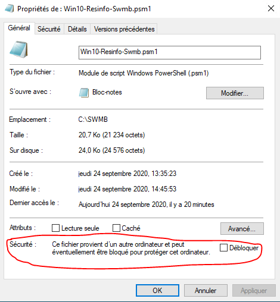
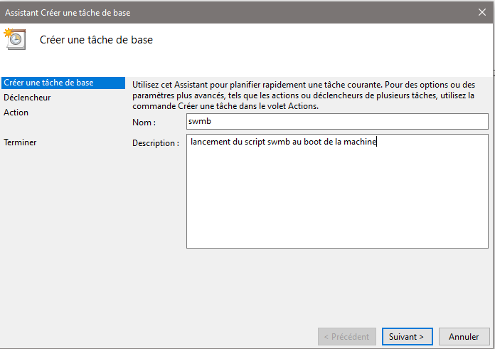
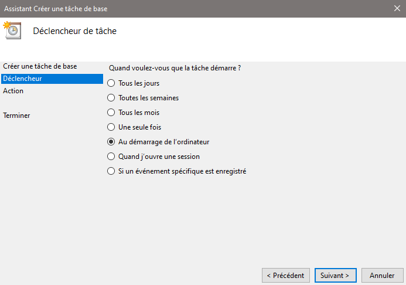

# Exemple de déploiement manuel du script

## Quelques rappels

Sur une machine Windows 10 build 2004,
la politique d’exécution des scripts powershell par défaut est du type «restricted» ce qui ne permet pas d’exécuter directement de scripts (dont les nôtres...) :
[Execution-Policy](https://docs.microsoft.com/en-us/powershell/module/microsoft.powershell.core/about/about_execution_policies?view=powershell-7).

Nous allons donc, lorsque nous allons exécuter le script, modifier temporairement la politique.
Nous la mettrons à RemoteSigned ce qui permet l’execution de scripts locaux non signés et de scripts téléchargés depuis internet s’ils sont signés numériquement.
Lorsque vous allez les télécharger (à la main, via un git clone...), les scripts SWMB sont bien entendu considérés comme téléchargés depuis internet.
Et (pour l’instant!) nos scripts SWMB ne sont pas signés numériquement.
Il faut donc les «débloquer» pour que powershell les considère comme des scripts locaux.
Voici un lien sur le [sujet](https://social.technet.microsoft.com/Forums/en-US/06d3fe24-9bc7-41a5-b551-57a10e813d07/execution-policy-remotesigned-how-does-powershell-know-if-i-downloaded-the-script?forum=ITCG).

## Exemple d’installation/Exécution du script “à la main”

### Exécution “one shot”

* Récupérer les scripts SWMB (par un git clone par exemple) dans `C:\SWMB` par exemple
  
* Aller dans les propriétés de tous les fichiers `.ps1` et `.psm1` et débloquer les fichiers de la façon suivante
* 
* En ligne de commande Powershell
```ps
dir -Path C:\SWMB -Recurse | Unblock-File
```  
* Ouvrir une session powershell en tant qu’administrateur et exécuter
  ```ps
  Set-ExecutionPolicy -ExecutionPolicy RemoteSigned -Scope Process
  ```
  
* Exécuter la commande powershell de lancement du script avec les fichiers de preset que vous avez sélectionné
  (cf. [README](https://gitlab.in2p3.fr/resinfo-gt/swmb/-/blob/master/README.md)).
  *Exemple avec le fichier de preset `UserExperience`* :
  ```ps
  &'C:\SWMB\Win10-Initial-Setup-Script\Win10.ps1' `
    -include 'C:\SWMB\Win10-Initial-Setup-Script\Win10.psm1' `
    -include 'C:\SWMB\Win10-Resinfo-Swmb.psm1' `
    -preset 'C:\SWMB\Presets\UserExperience-Resinfo.preset'
  ```

### Création manuelle d’une tâche planifiée qui exécute le script au démarrage du PC

* Dans le planificateur de tâches, créer une «tâche de base» et renseigner de la façon suivante (en considérant qu’on lance le même script que dans l’exemple ci-dessus)
  
* 
  
* 
  
* 
  
* 

* Dans *Argument*, la commande est :
  ```ps
  -ExecutionPolicy RemoteSigned -file "C:\SWMB\Win10-Initial-Setup-Script\Win10.ps1" -include "C:\SWMB\Win10-Initial-Setup-Script\Win10.psm1" -include "C:\SWMB\Win10-Resinfo-Swmb.psm1" -preset "C:\SWMB\Presets\UserExperience-Resinfo.preset"
  ```

* 
